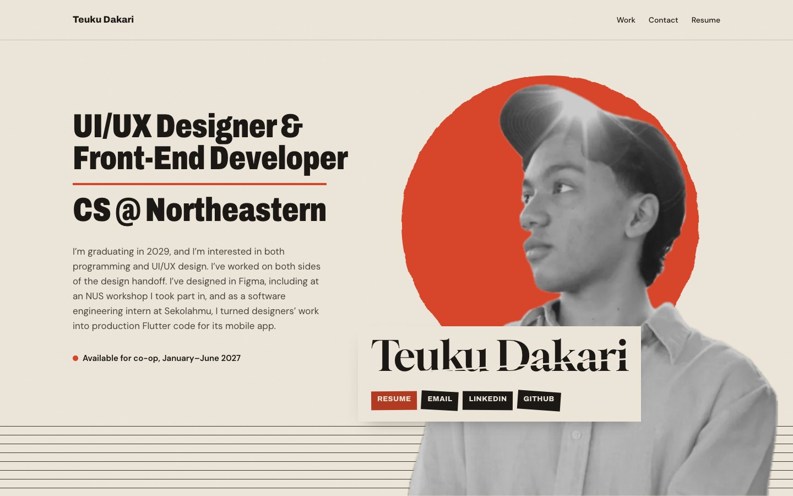

# dakari.dev

The portfolio of **Teuku Dakari**, a UI/UX designer and computer science student at Northeastern University.

**Live site: [dakari.dev](https://dakari.dev)**



## Case studies

| Project | What it is | My role |
|---|---|---|
| [Melasma Clinic by Dr. Tompi](https://dakari.dev/projects/clinic.html) | The first website for a new chain of dermatology clinics in Indonesia | Website designer and developer |
| [City of Oakland: AI Document Accessibility Converter](https://dakari.dev/projects/oakland.html) | A tool that turns city documents into WCAG-compliant versions | UI designer and front-end developer, design system |
| [FitCheck](https://dakari.dev/projects/nus.html) | A fashion super-app concept, First Prize at the NUS School of Computing summer workshop | Team lead, Virtual Wardrobe, design system |

## Built with

- Plain HTML and CSS, with a few lines of inline JavaScript for the high contrast toggle, the EN/ID switch, and copying an email address. No framework and no build step.
- [Archivo](https://fonts.google.com/specimen/Archivo) for display type, [DM Sans](https://fonts.google.com/specimen/DM+Sans) for body text, and [Gloock](https://fonts.google.com/specimen/Gloock) for the name.
- Hosted on [Vercel](https://vercel.com), which redeploys on every push to `main`.
- Built with help from Claude Code.

## Design notes

- **A printed-poster world.** Paper, ink, and one vermilion accent, inspired by modernist posters and the character-select screens in Valve's Deadlock.
- **Each case study has its own art direction.** Melasma Clinic moves from fragments to a finished site, the City of Oakland page borrows its patterns from our accessible chart and has a working high contrast mode, and FitCheck is styled in FitCheck's own design system.
- **Accessible by default.** Text meets WCAG AA contrast, keyboard focus is always visible, decorative type is hidden from screen readers, and every image has alt text.
- **Respects reduced motion.** If "Reduce motion" is on, entrance animations and the moving contact tags stop.

## Project structure

```
.
├── index.html            # Home page: hero, selected work, contact
├── projects/             # Case study pages
│   ├── clinic.html       # Melasma Clinic
│   ├── oakland.html      # City of Oakland
│   └── nus.html          # FitCheck
├── 404.html
├── css/
│   ├── poster.css        # Shared styles and design tokens
│   ├── melasma.css       # Per-case-study art direction
│   ├── oakland.css
│   └── fitcheck.css
├── images/               # Screenshots and art, one folder per project
├── assets/               # Resume and certificate PDFs
└── docs/preview.jpg      # Screenshot used in this README
```

## Run it locally

No install needed. Open `index.html` in a browser, or start a local server from the project folder:

```bash
python3 -m http.server 8000
```

Then visit http://localhost:8000.

## Credits

- **FitCheck** was designed with Li Ka Kit, Ji Caitong, and Chen Xiangning.
- **The City of Oakland project** was built with Anthony Bazhenov, Sun Choi, Audrey Tung, and Dani Luo, with Anh Nguyen as principal investigator and Professor Miguel Fuentes-Cabrera as mentor.
- Screenshots of client and team projects belong to their respective owners.

## License

The site's code is free to look through and learn from. The written content, images, and resume are © Teuku Dakari (and, for project screenshots, their respective owners) and may not be reused without permission.
